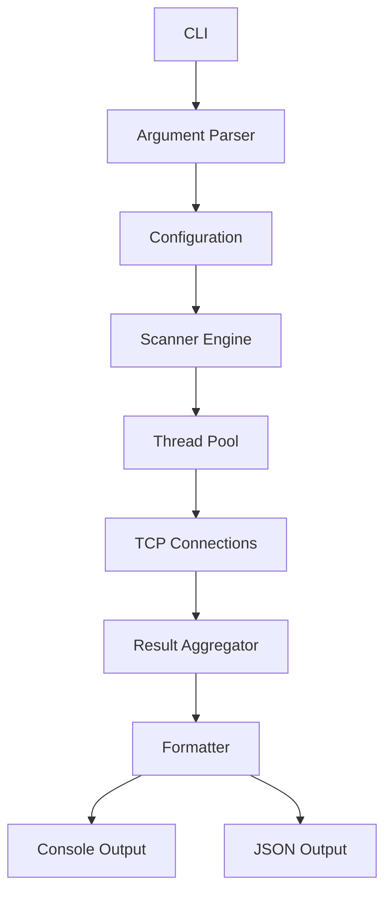
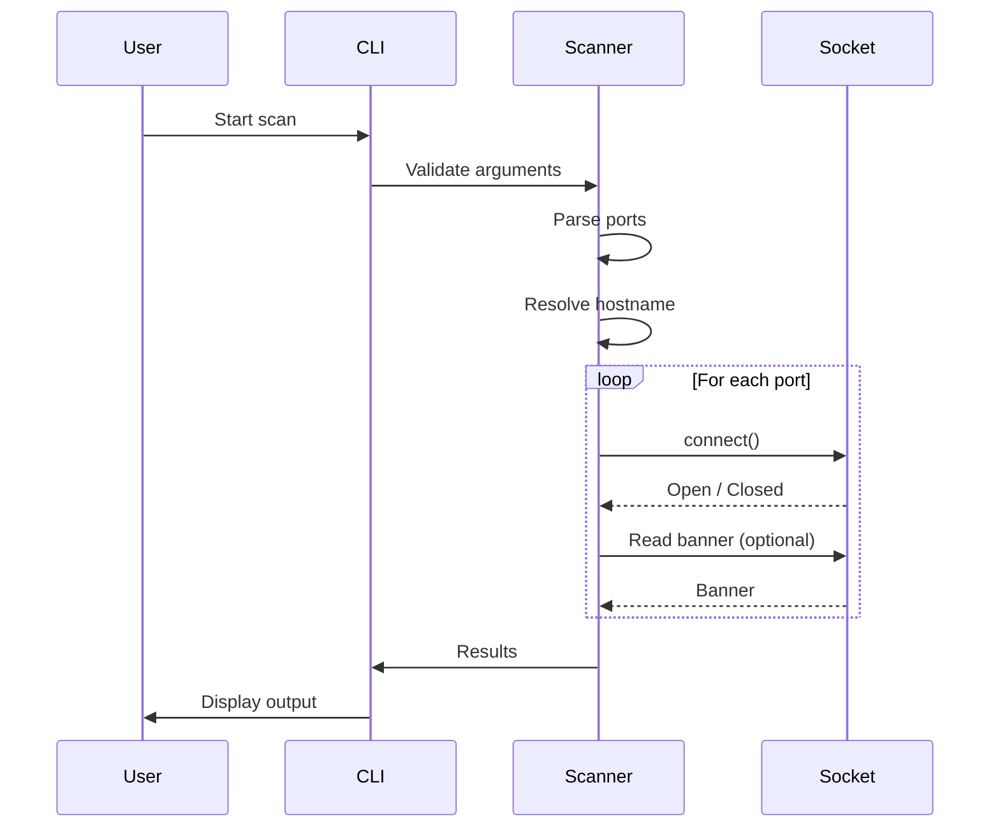
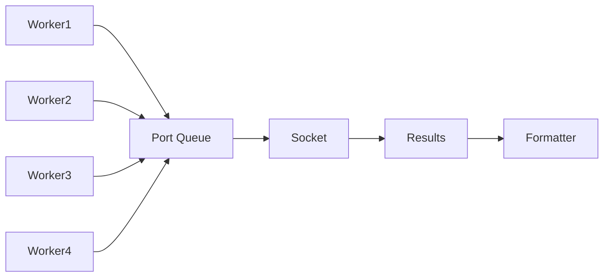
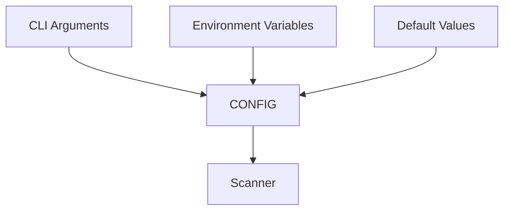
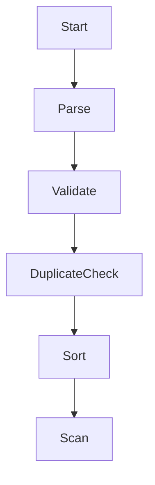
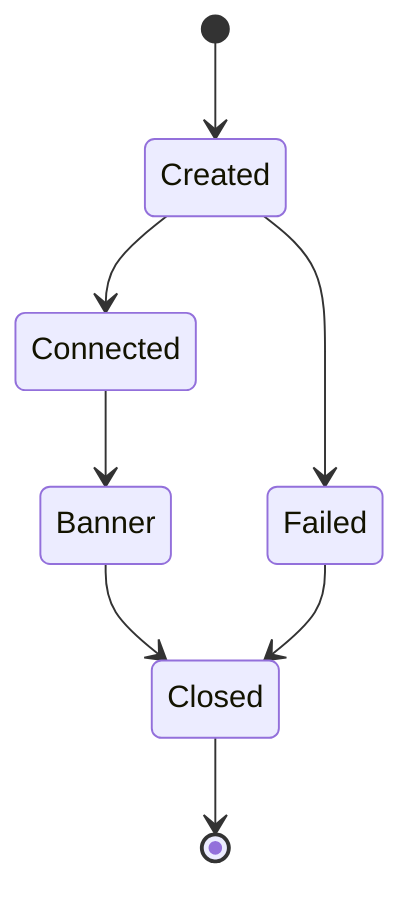
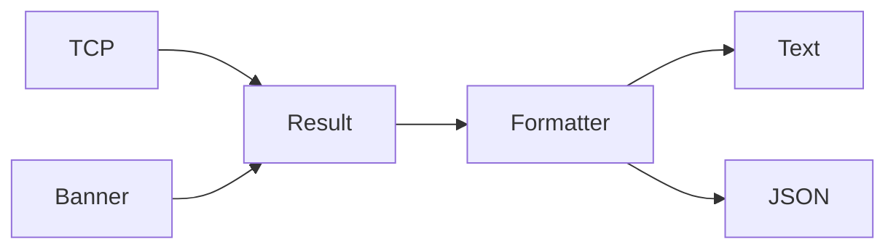
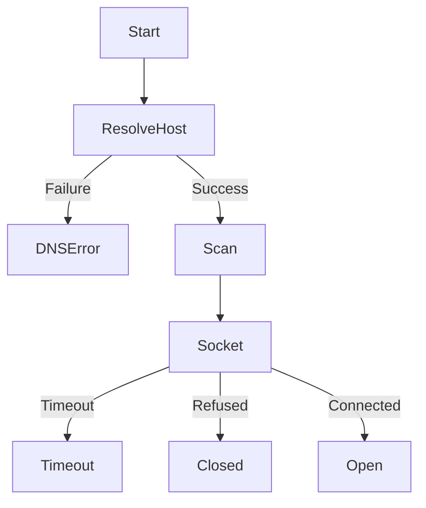
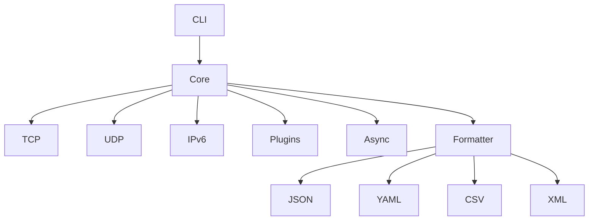
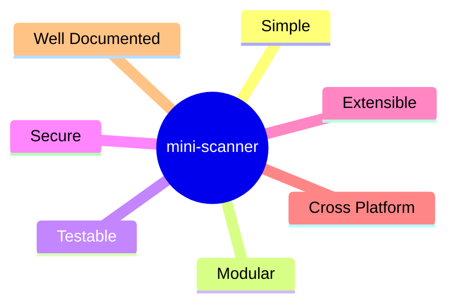

# Architecture Diagrams

This page provides visual representations of the internal architecture and execution flow of **mini-scanner**.

---

# High-Level Architecture

---

# Scan Lifecycle

---

# Thread Pool Workflow

---

# Configuration Priority

---

# Port Processing

---

# Socket Lifecycle

---

# Result Pipeline

---

# Error Handling

---

# Future Architecture

---

# Design Principles

